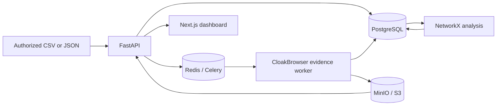

# Facebook Engagement Evidence System

An operator facing MVP for analyzing **authorized** Facebook engagement imports and preserving evidence from publicly visible or otherwise legitimately accessible profiles. Scores identify candidates for review; they do not establish that an account is fake or automated.

## Architecture



The application never collects reactions directly from Facebook. Operators supply data through CSV or JSON. The `AuthorizedFacebookProvider` interface reserves a place for a separately authorized integration. A profile is eligible for capture only after a threshold check, and a recent valid snapshot is reused across posts.

## Start

### Native Python on Windows, Linux, and macOS

Python 3.12 or newer is required. This mode needs no Docker, PostgreSQL, Redis, MinIO, or Node. It uses SQLite, local evidence files, and an in-process capture queue. A browser dashboard is served directly by FastAPI at `http://127.0.0.1:8000`.
On Linux or macOS, use `python3` in place of `python` if that is the installed command.

```sh
python -m venv .venv
```

Activate the environment with `.\.venv\Scripts\Activate.ps1` on Windows PowerShell, `.venv\Scripts\activate.bat` on Windows Command Prompt, or `source .venv/bin/activate` on Linux/macOS. Then run:

```sh
python -m pip install -r services/api/requirements.txt
python -m cloakbrowser install
python run.py
```

On first launch, the command prints a generated admin password and stores it with the signing key in `storage/evidence/native-secrets.json`. Save the password; on later launches, read it from that local file if needed. You may override both values with environment variables. For sample data, run `python run.py --seed`. On a headless Linux host, Chromium may need OS browser libraries; `python -m playwright install-deps chromium` installs them where supported. Use `python run.py --host 0.0.0.0` only behind a trusted reverse proxy with HTTPS.

### Docker Compose

1. Copy `.env.example` to `.env`. Change `APP_SECRET` and `ADMIN_PASSWORD` to long random values.
2. Run `docker compose up -d --build`.
3. Open `http://localhost:3000/settings`, sign in, then open Dashboard.
4. API docs are at `http://localhost:8000/docs`. MinIO console is at `http://localhost:9001`.

The API container runs `alembic upgrade head` on startup. For manual migrations: `docker compose exec api alembic upgrade head`. To seed development data: `docker compose exec api python -m app.seed`. The seed is synthetic and contains 20 posts, 2,000 interactions, 600 actors, a recurring 50 actor set, a burst event, and an avatar similarity group.

## Proxy and authorized session

The evidence worker uses [CloakBrowser's Python Playwright-compatible API](https://github.com/CloakHQ/CloakBrowser/blob/main/README.md). It accepts one fixed HTTP, HTTPS, or SOCKS5 proxy. Set `BROWSER_PROXY_SERVER`, and set both `BROWSER_PROXY_USERNAME` and `BROWSER_PROXY_PASSWORD` if the proxy requires authentication. Proxy rotation, GeoIP matching, human-like input, and automatic challenge handling are not enabled.

For an operator-owned Facebook session, run `python session_setup.py` on a machine with a visible desktop. Log in manually in the opened browser, then press Enter in the terminal. The script writes only Facebook cookies and origin storage to `secrets/facebook-state.json`; the file is ignored by Git. Set `BROWSER_STORAGE_STATE_PATH=secrets/facebook-state.json` for native Python mode. In Docker Compose, use `BROWSER_STORAGE_STATE_PATH=/app/secrets/facebook-state.json`; the worker mounts `./secrets` read-only. Protect this file as a credential, do not share it, and remove it when access is revoked. On Unix the worker rejects files readable by other users. If Facebook presents a login challenge, checkpoint, 403, or 429, capture stops for manual review.

## Import interactions

The companion Chrome extension `autoscrollfb` can be used on its own to capture reaction lists, compare profile signals and export an evidence PDF. After a scan, its **Tải JSON** action exports the current records and a `scans` bundle. To import that bundle here, sign in as ADMIN or ANALYST and choose **Import extension JSON** on the Posts page. The same upload is available at `POST /api/import/extension` in the API docs at `http://127.0.0.1:8000/docs`. An ADMIN can then run `POST /api/analyze/all` to refresh backend signals. This connection is optional; the extension does not need the backend to operate.

Extension scan timestamps mark when the list was collected, not when each user reacted. The backend tags these rows as `extension_scan` and excludes them from reaction-burst detection. Group member profile links and direct `profile.php?id=` links with the same numeric user ID are treated as one actor. The extension's local history keeps at most 2,000 actors per previous post and 20 posts; its JSON export includes all records from the current scan, while older scans in the bundle may be partial.

Add post URLs in the Posts page or import a UTF-8 CSV with columns:

```csv
post_url,profile_url,display_name,reaction_type,observed_at
https://www.facebook.com/example/posts/1,https://www.facebook.com/example.profile,Example,LIKE,2026-01-01T10:00:00Z
```

Use a bearer token from `POST /api/auth/login` for API calls. JSON imports accept an array of objects with the same fields at `POST /api/import/json`. Valid reaction types are `LIKE`, `LOVE`, `HAHA`, `WOW`, `SAD`, `ANGRY`, `CARE`, `COMMENT`, and `OTHER`.

## Analysis and evidence

`POST /api/analyze/all` rebuilds explainable signals and cross-post clusters. Scores are capped at 100. Current weights are cross-post recurrence 25, burst participation 20, avatar similarity 20, repeated cluster membership 20, name pattern 10, and low metadata 5. The latter two are reserved weights and are not generated yet. Only scores at or above `SCREENSHOT_THRESHOLD` enter the capture queue. Triggering analysis queues eligible profiles; a recent snapshot is reused.

The worker reuses one CloakBrowser process across up to `BROWSER_MAX_JOBS` captures, with one context per capture. It stops on 403, 429, checkpoint, login, or restriction pages and marks browser health `NEEDS_MANUAL_REVIEW`. An admin may call `POST /api/system/resume` after resolving the issue. It does not bypass access controls. Captures use viewport screenshots by default, then store SHA-256 and a chained record hash. `GET /api/evidence/verify/{actor_id}` checks both the chain and stored screenshot bytes, returning `VALID`, `BROKEN`, or `INCOMPLETE`. A post report ZIP contains HTML, JSON, screenshots, hashes, and chain status.

## Configuration

See `.env.example` for all options. Key settings: `DATABASE_URL`, `REDIS_URL`, S3 endpoint and credentials, `APP_SECRET`, `ADMIN_PASSWORD`, optional `ANALYST_PASSWORD` and `VIEWER_PASSWORD`, `STORE_RAW_IDENTIFIERS=false`, `SCREENSHOT_THRESHOLD=50`, profile TTLs (30/7/1 days), `BROWSER_MAX_JOBS=200`, `CAPTURE_FULL_PAGE=false`, and `EVIDENCE_RETENTION_DAYS=180`.

## Local checks

```sh
cd services/api
python -m pip install -r requirements.txt
pytest -q
ruff check app tests

cd ../../apps/web
npm install
npm run typecheck
npm run build
```

## Privacy and limitations

Actor identity uses HMAC-SHA256 over a normalized identifier. Raw identifiers are disabled by default. The public profile URL and display name remain visible to operators because capture and review require them. `DELETE /api/actors/{id}` removes the actor and linked records, then deletes its evidence objects. Aggregate counts change accordingly. Retention days are configurable but automatic retention cleanup is not yet scheduled.

The MVP uses shared passwords per role and bearer tokens; role claims are enforced by API endpoints, but user management is not implemented. The browser worker uses one capture at a time despite higher configurable ceilings. Image similarity is one heuristic and can group reused legitimate images. Network analysis uses exact post-set groups for large posts and limits pairwise comparison to `MAX_PAIRWISE_POST_ACTORS`; partially overlapping groups on larger posts may be missed. There is no automatic Facebook ingestion or private profile access. CloakBrowser uses a modified Chromium binary even when this application passes `stealth_args=False`; deployment should be reviewed against the operator's access terms.
